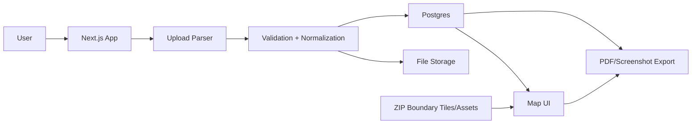

# Architecture Plan

## Recommended Architecture

## Application Layers

### Frontend

- Next.js app
- Project list/dashboard
- Project detail page
- Upload modals
- Map canvas
- Layer/filter sidebar
- Export/report view

### Backend/API

- Upload endpoints
- Project CRUD
- Dataset CRUD
- Dealership CRUD
- Optional geocoding endpoint
- Optional competitor lookup endpoint

### Database

Use Postgres through Supabase or Neon.

Core tables:

- `projects`
- `uploads`
- `audience_datasets`
- `audience_zip_counts`
- `dealerships`
- `project_dealerships`
- `saved_views` (optional)

### File Storage

Store original uploaded CSV/XLSX files in object storage:

- Supabase Storage, or
- S3

Do not store uploaded files on the app server filesystem.

## Map Strategy

### Preferred

Use MapLibre GL with optimized ZIP boundary vector tiles or simplified static assets.

Reasons:

- Better fit for polygon-heavy maps
- Handles many shapes more smoothly than basic Leaflet
- Better long-term path for layers, styling, and performance

### Acceptable Lean MVP

Use Leaflet if speed of development matters more than long-term scalability.

If Leaflet is used:

- Keep ZIP polygons simplified
- Avoid one huge GeoJSON payload
- Load only ZIPs required for active dataset/view
- Consider top-N or viewport-based loading for large files

## ZIP Boundary Lessons From Current Dashboard

Current dashboard reference files:

- `lookerStudioDashboard/dashboard/src/components/ZipHeatmap.tsx`
- `lookerStudioDashboard/dashboard/src/app/api/zcta-boundaries/route.ts`

Important lesson:

The existing dashboard hit memory limits when thousands of ZIP polygons were fetched/rendered at once. This new product should avoid full-payload Census GeoJSON requests.

Recommended options:

1. Generate/host simplified ZIP vector tiles.
2. Use pre-simplified state/regional GeoJSON and load by viewport.
3. Keep an API cap and surface clear UI language if limiting rendered ZIPs.

## Hosting (decided)

- **Render** — Next.js app (same pattern as `lookerStudioDashboard`)
- **Supabase** — Postgres, Auth, uploaded file storage
- **DO Spaces** (or Supabase Storage) — PMTiles and static assets
- **MapLibre** — map rendering
- MapTiler/Stadia/Mapbox for basemap tiles (API key on Render)

Avoid:

- Storing files on the app server
- Loading large GeoJSON files into server memory per request

